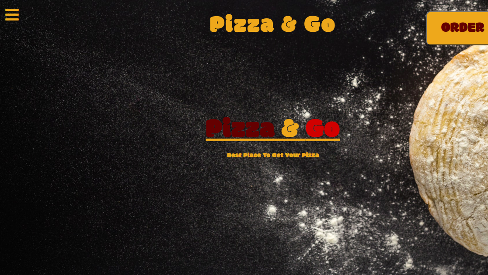

# Pizza & Go
This is a a web application for a pizza store to order and inquire for deliveries.

## Project Live Link
- [Click for to view the site](https://derrickodhiambo.github.io/IP4-Pizza-Go/)

## Live Image Demo

## Setup
No installation required for the application. To start this project, cloning or  to your own repository would be ideal.
To clone use the following commands:
- `git clone https://github.com/DerrickOdhiambo/IP4-Pizza-Go.git`
- `cd IP4-Pizza-Go`
- `code .`
- `atom . ` [//] : # (if atom is your preffered text editor)

## Author
- [Derrick Odhiambo](https://github.com/DerrickOdhiambo/IP4-Pizza-Go)

## Behavior Driven Development

### Example
|Behavior|Input Example|Output Example|
|--------|-------------|--------------|
|PickUp option|Large Deep Pan Crust Pepperoni, sausage 1|Pizza size: Large for Ksh. 900 Crust type : Deep Pan crust for Ksh 100 Toppings : Pepperoni, sausage, green pepper, onion, and mushroom for Ksh. 150 Number of Pizza : 1 Your total amount is : Ksh. 1150|
|Delivery Option|Medum Deep Pan Crust Pepperoni, sausage 1|Form for persons name, contact and location|
|Delivery Form|Derrick 07.. Juja|Thank you Derrick for trusting us. Your order will be delivered at Juja soon|

## Technologies Used
- HTML & CSS
- Bootstrap 4
- jQuery & JavaScript

### Known Bugs
- Some of the code for incoporating JavaScript constructors and prototypes are not tested.

## Contact
- odhiamboderrick56@gmail.com

## License
MIT License

Copyright (c) [2020] [Derrick Odhiambo]

Permission is hereby granted, free of charge, to any person obtaining a copy
of this software and associated documentation files (the "Software"), to deal
in the Software without restriction, including without limitation the rights
to use, copy, modify, merge, publish, distribute, sublicense, and/or sell
copies of the Software, and to permit persons to whom the Software is
furnished to do so, subject to the following conditions:

The above copyright notice and this permission notice shall be included in all
copies or substantial portions of the Software.

THE SOFTWARE IS PROVIDED "AS IS", WITHOUT WARRANTY OF ANY KIND, EXPRESS OR
IMPLIED, INCLUDING BUT NOT LIMITED TO THE WARRANTIES OF MERCHANTABILITY,
FITNESS FOR A PARTICULAR PURPOSE AND NONINFRINGEMENT. IN NO EVENT SHALL THE
AUTHORS OR COPYRIGHT HOLDERS BE LIABLE FOR ANY CLAIM, DAMAGES OR OTHER
LIABILITY, WHETHER IN AN ACTION OF CONTRACT, TORT OR OTHERWISE, ARISING FROM,
OUT OF OR IN CONNECTION WITH THE SOFTWARE OR THE USE OR OTHER DEALINGS IN THE
SOFTWARE.